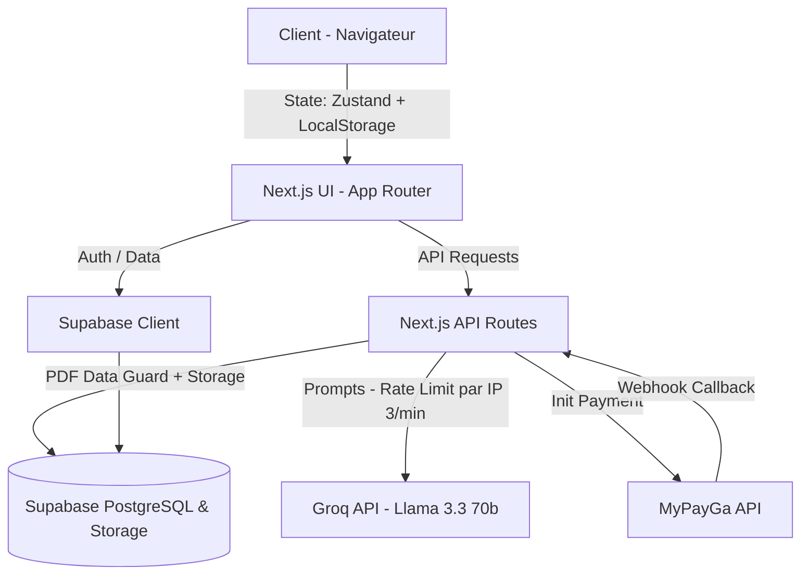

# 🎯 ROADMAP & PLAN STRATÉGIQUE — MonCV.ga

## 🏗️ 1. Architecture Système



## 🗄️ 2. Schéma de Base de Données (Supabase)

- **`profiles`** : `id` (uuid, references auth.users), `full_name`, `created_at`
- **`cvs`** : `id` (uuid), `user_id` (uuid, NOT NULL — les anonymes restent en localStorage), `title` (text), `content` (jsonb), `is_paid` (bool default false), `template_id` (text), `created_at`, `updated_at`
- **`payments`** : `id` (uuid), `cv_id` (uuid), `user_id` (uuid), `amount` (int), `status` (text: pending, completed, failed), `provider_reference` (text), `created_at`
- **`ai_usage_logs`** : `id` (uuid), `ip_address` (text), `action` (text), `created_at` (timestamp)

**Stratégie RLS (Row Level Security) :**
- `profiles` : Lecture/Écriture uniquement par l'utilisateur (`auth.uid() = id`).
- `cvs` : Lecture/Écriture uniquement si `auth.uid() = user_id`. Pas de condition nullable — tout CV en DB appartient à un user authentifié.
- `payments` : Lecture par le propriétaire (`auth.uid() = user_id`). Insertion uniquement via API Routes (Service Role).
- `ai_usage_logs` : Uniquement insertable depuis les API Routes (Service Role Key) pour tracer les IPs.

## 👤 3. Flux Utilisateur Complet

1. **Visiteur Anonyme** : Arrive sur la landing page -> Clic sur "Créer mon CV".
2. **Éditeur** : Remplissage des données. Appel à l'assistant IA gratuit (rate-limité : 3 appels/min/IP, max 10 appels/CV). Sauvegarde dans le `localStorage` via Zustand persist (debounced 2s).
3. **Preview** : Affichage en direct via `@react-pdf/renderer`. Si CV non payé, filigrane CSS + filigrane intégré dans le rendu PDF.
4. **Tentative de Téléchargement** :
   - Ouvre une modal "Télécharger votre CV (1000 FCFA)".
5. **Authentification** :
   - S'il n'est pas connecté, modal de Login/Register.
   - Dès la connexion, le CV en `localStorage` est inséré dans la table `cvs` dans Supabase. Le localStorage est **purgé** après migration réussie.
6. **Paiement** :
   - Interface Checkout (saisie numéro de tel Airtel/Moov).
   - Appel API MyPayGa → init payment.
   - **Webhook serveur** : MyPayGa appelle `/api/payment/webhook` qui met `is_paid = true` (source de vérité).
   - **Polling client** : Le front poll `/api/payment/status/[paymentId]` chaque 5s pendant 3 mins (affichage "En attente sur mobile" avec compte à rebours). Le polling sert uniquement à rafraîchir l'UI, pas à modifier le statut.
7. **Succès & Download** :
   - L'API `/api/cv/[cvId]/download` vérifie `is_paid = true` en DB avant de renvoyer le contenu complet.
   - Le client génère le PDF final via `PDFDownloadLink` (client-side) avec les données vérifiées.

## 💾 4. Stratégie de Persistance et Hydratation

- Utilisation de Zustand **`persist` middleware** (nom: `cv-storage`).
- **Hydration** : `onRehydrateStorage` callback pour setter un flag `isHydrated`. L'éditeur ne se render qu'après hydratation.
- **Migration localStorage → Supabase** : Un composant `SyncProvider` écoute `onAuthStateChange`. Si l'utilisateur se connecte et a un CV local :
  1. POST vers `/api/cv/migrate` avec les données locales
  2. Récupération de l'ID Supabase
  3. Purge du localStorage
  4. Redirect vers `/editor/[newCvId]`
- **CVs multiples** : Après connexion, le bouton "Créer un CV" crée un nouveau CV vide en DB directement (plus de localStorage pour les users auth). Le dashboard `/dashboard` liste tous les CVs de l'utilisateur.

## 🔒 5. Sécurité & Intégrité

1. **Anti-fraude téléchargement** :
   - Le contenu complet du CV (sans watermark) n'est JAMAIS envoyé au client avant vérification serveur.
   - Route `/api/cv/[cvId]/download` : vérifie `is_paid` en DB via Service Role, puis renvoie le JSON complet.
   - Côté client, le `PDFDownloadLink` appelle cette route pour obtenir les données, puis génère le PDF.

2. **Webhook MyPayGa (source de vérité)** :
   - Route POST `/api/payment/webhook` :
     - Valide la signature/IP de MyPayGa
     - Met à jour `payments.status = 'completed'`
     - Met à jour `cvs.is_paid = true`
   - Le polling client ne fait que LIRE le statut, il ne le modifie jamais.

3. **Rate-limiting IA** :
   - Côté serveur (`/api/ai/route.ts`) : rate-limit par IP via `ai_usage_logs` (3 requêtes/min, 1000 requêtes/jour global).
   - Si Groq renvoie 429, l'API renvoie un message user-friendly + suggestions pré-écrites en fallback.
   - Prévoir migration vers Groq Developer Tier ($) dès les premiers revenus.

## 🔎 6. Contraintes Techniques Identifiées

1. **Next.js & @react-pdf/renderer** :
   - `@react-pdf/renderer` crashe en SSR (dépendance DOM).
   - **Solution** : Tous les composants PDF dans un wrapper `PDFWrapper.tsx` importé via `next/dynamic(..., { ssr: false })`. `"use client"` obligatoire.
   - Ajouter `serverComponentsExternalPackages: ['@react-pdf/renderer']` dans `next.config.js`.

2. **Limites Vercel Free Plan** :
   - Timeout 10s par défaut (configurable jusqu'à 300s).
   - Bundle max 250MB — la génération PDF se fait **côté client** pour ne pas exploser cette limite.
   - Payload max 4.5MB par requête.

3. **Limites Groq Free Tier** :
   - 12K tokens/min, 1K requêtes/jour.
   - Suffisant pour un MVP pré-launch, insuffisant dès 50+ users/jour actifs.

4. **MyPayGa** :
   - Délai USSD variable (l'utilisateur doit taper un code sur son téléphone).
   - Polling avec countdown visuel (3:00) + message explicite "Validez le paiement sur votre téléphone".

## 📊 7. Analytics & Monitoring

- **Vercel Analytics** : Activé (gratuit) pour le trafic + Web Vitals.
- **Error tracking** : `try/catch` structurés dans toutes les API Routes avec logging console (Vercel Logs). Migration Sentry si scale.
- **Conversion funnel** : Tracker via events simples dans une table `events` ou dans `ai_usage_logs` étendu :
  - `page_view:landing` → `editor_started` → `auth_completed` → `payment_initiated` → `payment_completed` → `pdf_downloaded`

## 📁 8. Plan des Dossiers (Next.js App Router)

```text
/src
  /app
    /(public)              # Landing page, templates showcase, auth
      /page.tsx             # Landing
      /login/page.tsx
      /register/page.tsx
    /editor/[cvId]          # Interface d'édition (cvId = "new" pour anonyme localStorage)
      /page.tsx
    /checkout/[cvId]        # Paywall MyPayGa
      /page.tsx
    /dashboard              # Mes CVs (Auth required)
      /page.tsx
    /api
      /ai/route.ts          # Proxy Groq API + rate-limit IP
      /cv
        /migrate/route.ts   # Migration localStorage → Supabase
        /[cvId]
          /download/route.ts # Vérifie is_paid + renvoie données complètes
      /payment
        /init/route.ts      # Init paiement MyPayGa
        /webhook/route.ts   # Callback MyPayGa (source de vérité)
        /status/[paymentId]/route.ts  # Polling statut pour le front
  /components
    /editor                 # Formulaires éditeur, bindings Zustand
    /pdf                    # Composants @react-pdf (<Document>, <Page>, <View>...)
    /ui                     # Composants UI réutilisables
    /providers              # SyncProvider, AuthProvider
  /store
    /cv-store.ts            # Zustand Store + Persist logic
  /lib
    /supabase               # Client configs (SSR + Client + Service Role)
    /payment                # MyPayGa handlers
    /ai                     # Groq client helpers
    /rate-limit             # Rate limiting utils
  /types
    /cv.ts                  # Types CV (Zod + TS)
    /payment.ts             # Types Payment
/supabase
  /migrations               # DDL migrations
```

## 🚀 9. Phases de Build

### Phase 1 — Fondations (Semaine 1)
- [x] Architecture & Roadmap
- [ ] Init Next.js + Tailwind + shadcn/ui
- [ ] Setup Supabase (tables, RLS, auth)
- [ ] Zustand store + persist middleware
- [ ] Layout global (navbar, footer)
- [ ] Landing page

### Phase 2 — Éditeur (Semaine 2)
- [ ] Page éditeur avec formulaires (infos perso, expérience, éducation, compétences)
- [ ] Zustand bindings pour chaque section
- [ ] Preview PDF en temps réel (@react-pdf, dynamic import)
- [ ] Filigrane sur preview non-payée
- [ ] Assistant IA (proxy Groq + rate-limit)

### Phase 3 — Auth & Paiement (Semaine 3)
- [ ] Auth Supabase (login/register)
- [ ] Migration localStorage → Supabase
- [ ] Intégration MyPayGa (init + webhook + polling)
- [ ] Page checkout avec countdown
- [ ] Route download sécurisée
- [ ] Dashboard "Mes CVs"

### Phase 4 — Polish & Launch (Semaine 4)
- [ ] Templates CV additionnels
- [ ] Analytics Vercel
- [ ] SEO (meta tags, OG images)
- [ ] Tests E2E critiques
- [ ] Deploy production
